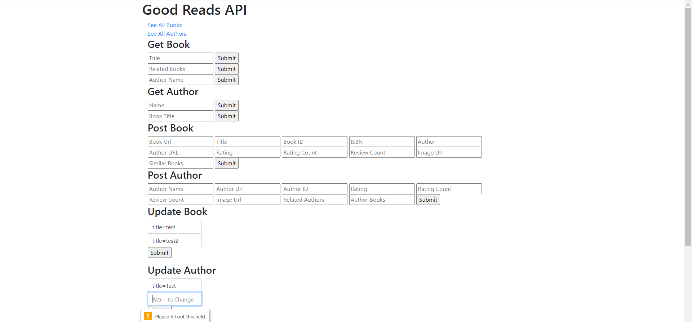

**Manual Test Plan**

**Environment**<br/>
Python v3.6 or greater<br/>
VSCode<br/>
MongoDB<br/>
PyMongo v3.11<br/>
BeautifulSoup<br/>

**Environment SetUp**<br/>
There are a couple of packages that are necessary within the environment.Please execute these commands on the terminal<br/>

```python
pip install beautifulsoup4
```

<br/>

```python
pip install pymongo
```

<br/>
After installing pymongo, you will need to create a .env file containing the user name, password and database name for the mongoDB Atlas database. Please make sure to include the .env file into the .gitignore file if using git.

<br/>

**Start Scraper**<br/>
To start the scraper, use command in the terminal

```python
python good_read_scraper.py
```

You will be prompted to input a url to start the scraping process.
This url needs to be a book page as such, https://www.goodreads.com/book/show/3735293-clean-code.
After inputting the url. You will see a series of updates in the terminal of where the scraping process is at.<br/>

When the scraper begins to run it will collect all similar authors up to 50 authors. WHile running, it will print out updates on how many authors have been collected so far.
<br/>
After collecting all the authors, it will begin finding all the similar books up to 200 books. It will periodically inform you where it is in the process of finding 200 books

<br/>
With the book gathering complete, it will now scrape each individual link for each author and book. As you can see, it says "Worked Hard...Gotta sleep" periodically. This is the application going to sleep for ~10 seconds to avoid requesting the website too often too fast.
When you see the prompts below, it will begin scraping the authors page, and the books page.
<br/>
<br/>
After finishing collecting data on all the authors and books, it will prompt you on the total amount of authors and books it has scraped.
All books and authors are distinct and have no repition in the data.
It will also inform you of when the data is formatted into a json file(s), and when it is transferred over to the data base you provided above.
<br/>


**Errors**
If there are any errors during the scrape. You will find in the database, the values will be Null for those specific values.

**Front End API GUI**<br/>
<br/>
**Set UP**

```python
pip install flask
```

```python
pip install pymongo
```

```python
pip install flask_pymongo
```

<br>
Run by using

```python
python MongoAPI.py
```

<br>

**Testing** <br>
PostMan v7.34

**View** <br>
When you run the application, you will be shown a link to a local host, where the GUI is currently running.
You will be greeted with this page when you click on the link.


**See all Book and Authors**<br>
When you click on these links you will see all the books and authors currently in the database. There is a button on the bottom of the page to redirect you to the main page.
After any update, delete, or insert into the data base, you will be able to see them here.


**Get Book and Author**<br>
You can query for a book or Author by inserting text into the fields.
When you send a query you will see a list of books and their authors or authors and their ratings as such.


You may only choose one field and it must be longer than 2 characters long, or else you will redirected to an error page. You will also be redirected to the error page if there are no matching queries.
Clicking on the "Back to Main Page" will redirect you to the home page.


**Post Author and Book**
The database hold a couple fields for a book and author entry. There is a placeholder for the entry fields that you may choose to enter. If you do not enter all fields, the empty fields will just remain empty for the data entry.


After putting in an entry for a book or a author. You will be able to review you entry and return to the main page.

**Update Autor and Book**
You also have the capability to update fields within a data entry. For example, if you wanted to change the name of a book, you can do it as such.
You must enter a attribute followed by the value, as such, title=test. There must be no spaces in between.

The first field is the filter used to find the data entry to want to update. The second field is the field you want to change in that entry.
If a success you will be prompted as such.

You will also be required to fill out both fields, if you do not, you will be prompted as such,


**Delete Author and Book**
To Delete a book it is similar to the update funcitonality.
You must enter a attribute followed by the value, as such, title=test. There must be no spaces in between.
When the request succeeds, you will see,

If you try and delete an entry that does not exist, you will see,

