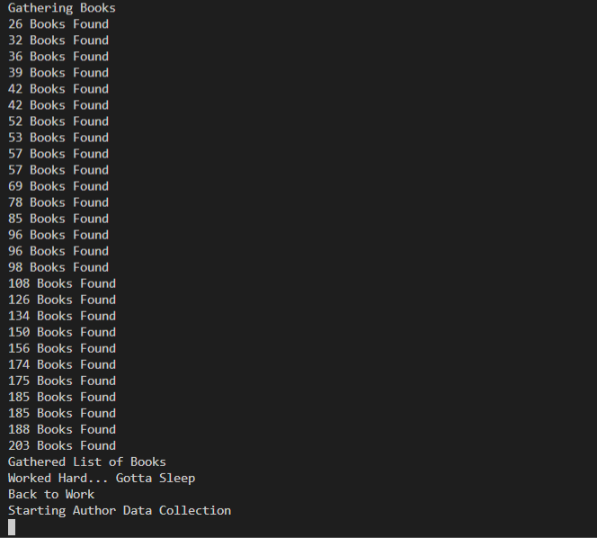

**Manual Test Plan**

**Environment**<br/>
Python v3.6 or greater<br/>
VSCode<br/>
MongoDB<br/>
PyMongo v3.11<br/>
BeautifulSoup<br/>

**Environment SetUp**<br/>
There are a couple of packages that are necessary within the environment.Please execute these commands on the terminal<br/>

```python
pip install beautifulsoup4
```

<br/>

```python
pip install pymongo
```

<br/>
After installing pymongo, you will need to create a .env file containing the user name, password and database name for the mongoDB Atlas database. Please make sure to include the .env file into the .gitignore file if using git.

<br/>

**Start Scraper**<br/>
To start the scraper, use command in the terminal

```python
python good_read_scraper.py
```

You will be prompted to input a url to start the scraping process.
This url needs to be a book page as such, https://www.goodreads.com/book/show/3735293-clean-code.
After inputting the url. You will see a series of updates in the terminal of where the scraping process is at.<br/>

When the scraper begins to run it will collect all similar authors up to 50 authors. WHile running, it will print out updates on how many authors have been collected so far.
<br/>
After collecting all the authors, it will begin finding all the similar books up to 200 books. It will periodically inform you where it is in the process of finding 200 books

<br/>
With the book gathering complete, it will now scrape each individual link for each author and book. As you can see, it says "Worked Hard...Gotta sleep" periodically. This is the application going to sleep for ~10 seconds to avoid requesting the website too often too fast.
When you see the prompts below, it will begin scraping the authors page, and the books page.
<br/>
<br/>
After finishing collecting data on all the authors and books, it will prompt you on the total amount of authors and books it has scraped.
All books and authors are distinct and have no repition in the data.
It will also inform you of when the data is formatted into a json file(s), and when it is transferred over to the data base you provided above.
<br/>


**Errors**
If there are any errors during the scrape. You will find in the database, the values will be Null for those specific values.
